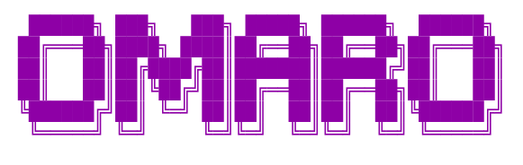

<p align="center">
    
</p>

<p align="center">TUI for <a href="https://lobste.rs">lobste.rs</a>. Browse posts and comments from the comfort of your terminal.</p>

<p align="center">
  
  
  <a href="https://aur.archlinux.org/packages/omaro"></a>
  <a href="https://lobste.rs"></a>
</p>


## Why

😎: Because TUIs are cool.

🤓👆:

1. Easier and faster to navigate (posts, comments, pages and modes) with various keybindings and the shortcuts system
2. Less resource intensive than using the website. A counter for the total
   downloaded bytes while using the TUI is included for comparison.

While other [lobste.rs](https://lobtes.rs) TUIs are available, I was not fully satisfied with them
so I wanted to make my own. Most importantly, it was just fun to make.

### Name

_Omaro_ is [Esperanto](https://en.wikipedia.org/wiki/Esperanto) for _lobster_ - _omaroj_ for _lobsters_
may have been more fitting but I like _omaro_ better.

## Features

- View posts and comments via the TUI
- Navigate through different modes (hottest, newest, active) and pages of results
- Open links directly in your browser, or the link to the comment section for the post
- Opened posts are marked as read and stored in a local database for future sessions
- Links can also be opened with the shortcuts system (press the key to the left of the post name)
- Extensive customisation, described in further detail below
- Vim-like keybindings (with support for e.g. arrow keys as well)
- Mouse support for basic functionality
- Results are cached so browsing back and forth between pages / modes does not cause a re-fetch
- Downloaded bytes counter to see how little your browsing needs to fetch from [lobste.rs](https://lobste.rs)
- Cross platform support
- Helpful keybinds popup with <kbd>?</kbd>

## Requirements

Many of the icons used by default require a [nerd font](https://www.nerdfonts.com/).

If you would rather avoid using one, modify the [default configuration](./configs/default.toml)
by replacing the icons used. More details below in the configuration section.

## Installation

### Cargo

```bash
cargo install omaro --locked
```

### AUR

```bash
paru -S omaro
```

### Manual / Build from source

```bash
git clone https://github.com/Rolv-Apneseth/omaro.git
cargo install --path ./omaro --locked
```

## Configuration

The full, default configuration file, with options described in comments, is defined [here](./configs/default.toml).

There are a couple of different configuration files defined in the [configs](./configs) directory
which you can choose as a starting point:

|                                                                                                                                 |                                                                                                                                  |
| :-----------------------------------------------------------------------------------------------------------------------------: | :------------------------------------------------------------------------------------------------------------------------------: |
| [Default](./configs/default.toml)    | [Minimal](./configs/default.toml)     |
| [Minimaler](./configs/default.toml)  | [Minimalest](./configs/default.toml)  |

`omaro` looks for a `config.toml` in an `omaro` directory in the user's config directory.
Use `omaro --help` and look at the default beside the `--config` flag to discover what this is on your system.

Alternatively, use that `--config` flag to specify a path to a configuration file.

> [!TIP]
> Run `omaro --clean` to ignore the configuration file and run with the default options

## Contributing

If you run into any problems, or have any suggestions/feedback, feel free to open an issue.

Any code or other contributions are also welcome.

## Credit

Many thanks to:

- [lobste.rs](https://lobste.rs) of course
- All the [dependencies](./Cargo.toml) of this project, and all [their dependencies](./Cargo.lock) too
- This program was inspired by [lobtui](https://github.com/pythops/lobtui), [lobste-rs](https://github.com/frectonz/lobste-rs) and [daily_hn](https://github.com/Rolv-Apneseth/daily_hn) (an _old_ project of mine)
- [vhs](https://github.com/charmbracelet/vhs), which is used to generate the demo GIF for the project
- [This site](https://patorjk.com/software/taag/), which was used to generate the ASCII art header(s)

## License

This code is licensed under the [AGPLv3](https://www.gnu.org/licenses/agpl-3.0.en.html#license-text).

See the [LICENSE](./LICENSE) file for license details.
